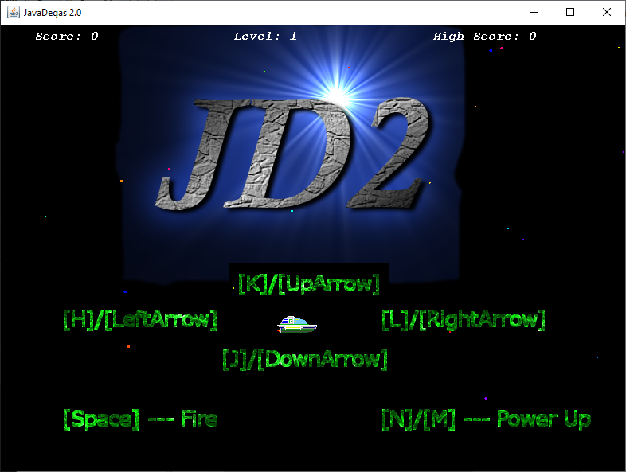
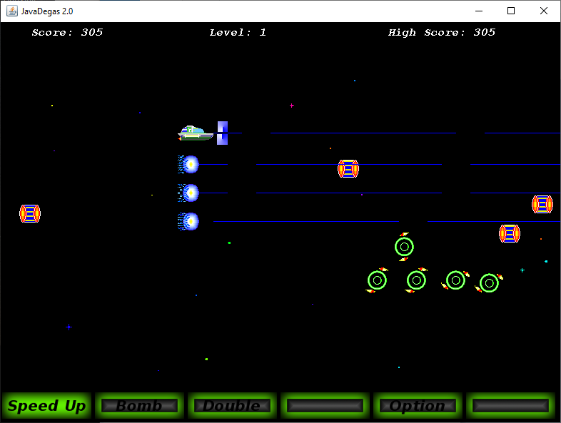
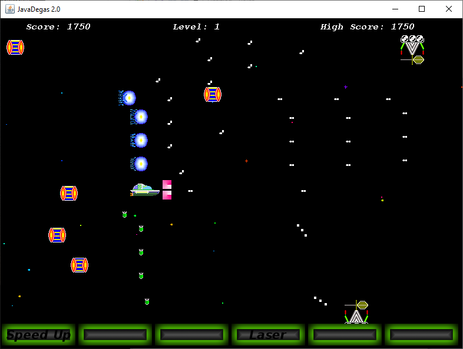
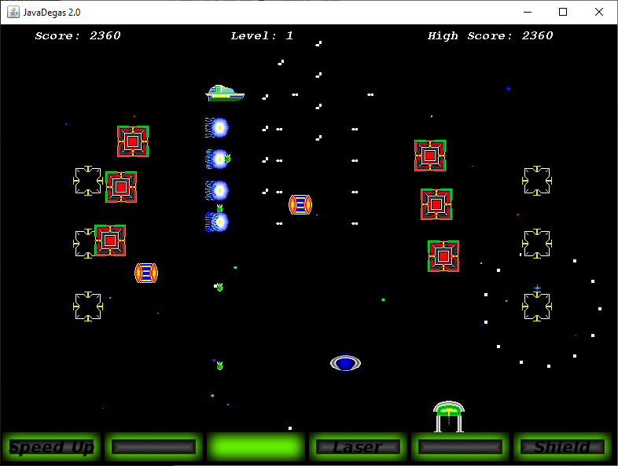
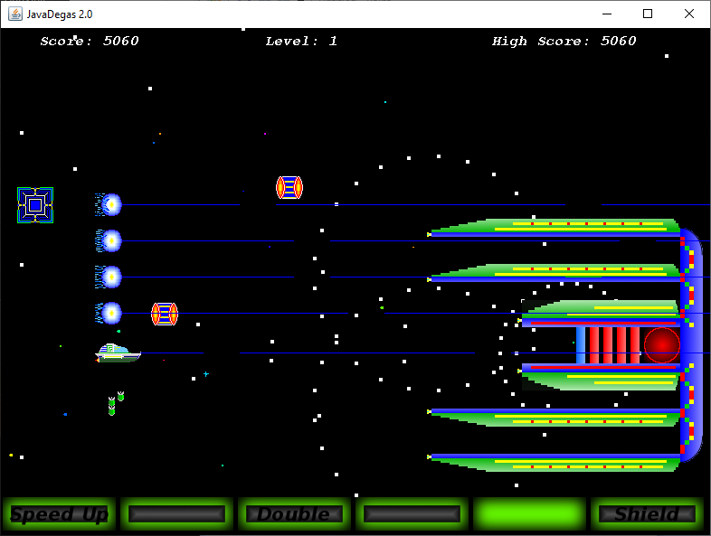

## How to Play

I included runnable jar file, __*JavaDegas2run.jar*__.  Download the entire package, because it needs images and sounds even if they are included in the jar file.  Then run that jar file.

Use **arrow** keys (or **h/j/k/l** keys like vi) to move the ship.

**Space** to fire and **m/n** keys to chose the power up item.

Written using Eclipse IDE for Java Developers version 2018-12 (4.10.0) with Java 1.8.

Enjoy.

## About JavaDegas2 v.1.0

JavaDegas is a [Gradius](https://en.wikipedia.org/wiki/Gradius_(video_game)) -like, straight forward "Shoot'em Up" game.  Original [JavaDegas](https://github.com/xyz24601/JavaDegas-1.0.1) was written as a Java Applet.  JavaDegas2 is a rewrite as a stand-alone application.

Use the **arrow** keys to move your ship and **space** to fire.  It has rapid fire capability, so no need to heep pounding on the **space** key.  You can just hold it down and it will keep firing.  You can also use **h, j, k, and l** keys to move your ship, yes, the good old vi editor key.  Certain enemies drop "Energy Capsule" when you blow them up.  Pick them up to move the power indicator, then select which power to obtain by pressing either **m or n**.  At the end of the stage, there is an enemy boss ship waiting.

I only wrote one stage.  People out there can add more enemies, boss ships, and stages.  It shouldn't be too difficult.

These are 6 power up items.

* **Speed Up:** increases speed
* **Bomb:** adds bomb
* **Double:** adds 45 degree angle fire
* **Laser:** sets to laser weapon that can penetrate multiple enemy ships
* **Option:** adds option that acts like an extra ship
* **Shield:** adds shield

## Screen shots

